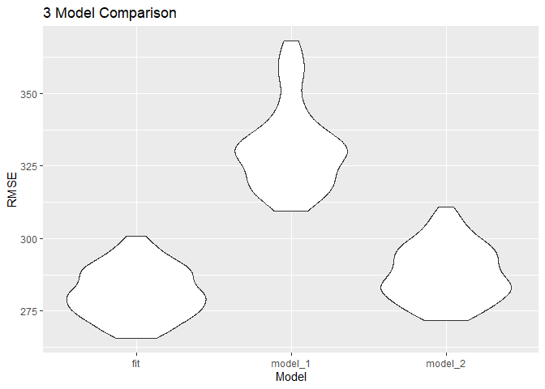

p8105\_hw6\_yo2336
================
Yoo Rim Oh

# Problem 1

Load and clean data

``` r
birth_weight =
  read_csv("data/birthweight.csv") %>%
  janitor::clean_names() %>%
  mutate_at(c("babysex", "frace", "malform", "mrace"), as.factor)
```

    ## Rows: 4342 Columns: 20

    ## -- Column specification --------------------------------------------------------
    ## Delimiter: ","
    ## dbl (20): babysex, bhead, blength, bwt, delwt, fincome, frace, gaweeks, malf...

    ## 
    ## i Use `spec()` to retrieve the full column specification for this data.
    ## i Specify the column types or set `show_col_types = FALSE` to quiet this message.

``` r
summary(is.na(birth_weight))
```

    ##   babysex          bhead          blength           bwt         
    ##  Mode :logical   Mode :logical   Mode :logical   Mode :logical  
    ##  FALSE:4342      FALSE:4342      FALSE:4342      FALSE:4342     
    ##    delwt          fincome          frace          gaweeks       
    ##  Mode :logical   Mode :logical   Mode :logical   Mode :logical  
    ##  FALSE:4342      FALSE:4342      FALSE:4342      FALSE:4342     
    ##   malform         menarche        mheight          momage       
    ##  Mode :logical   Mode :logical   Mode :logical   Mode :logical  
    ##  FALSE:4342      FALSE:4342      FALSE:4342      FALSE:4342     
    ##    mrace           parity         pnumlbw         pnumsga       
    ##  Mode :logical   Mode :logical   Mode :logical   Mode :logical  
    ##  FALSE:4342      FALSE:4342      FALSE:4342      FALSE:4342     
    ##    ppbmi            ppwt           smoken          wtgain       
    ##  Mode :logical   Mode :logical   Mode :logical   Mode :logical  
    ##  FALSE:4342      FALSE:4342      FALSE:4342      FALSE:4342

Regression model for birth weight

``` r
birth_weight_fit = lm(bwt ~ bhead + blength + delwt + gaweeks + wtgain, data = birth_weight)
broom::tidy(birth_weight_fit) %>%
  knitr::kable()
```

| term        |     estimate |  std.error |  statistic | p.value |
|:------------|-------------:|-----------:|-----------:|--------:|
| (Intercept) | -6173.556115 | 96.3126630 | -64.099111 |   0e+00 |
| bhead       |   135.199090 |  3.4946420 |  38.687536 |   0e+00 |
| blength     |    78.700757 |  2.0701331 |  38.017244 |   0e+00 |
| delwt       |     1.614934 |  0.2163650 |   7.463935 |   0e+00 |
| gaweeks     |    13.691146 |  1.4907416 |   9.184118 |   0e+00 |
| wtgain      |     2.178634 |  0.4359403 |   4.997552 |   6e-07 |

``` r
left_join(add_residuals(birth_weight, birth_weight_fit),
         add_predictions(birth_weight, birth_weight_fit)) %>%
  select(bwt, gaweeks, wtgain, resid, pred) %>%
  ggplot(aes(x = pred, y = resid)) +
  geom_point() +
  labs(title = "Residual vs Fitted", x = "Prediction", y = "Residual")
```

    ## Joining, by = c("babysex", "bhead", "blength", "bwt", "delwt", "fincome", "frace", "gaweeks", "malform", "menarche", "mheight", "momage", "mrace", "parity", "pnumlbw", "pnumsga", "ppbmi", "ppwt", "smoken", "wtgain")

<!-- -->

Compare 3 Models

``` r
cv_df = 
  crossv_mc(birth_weight, 100) %>%
  mutate(
    train = map(train, as_tibble),
    test = map(test, as_tibble)) %>%
  mutate(
    fit_model = map(train, ~lm(bwt ~ bhead + blength + delwt + gaweeks + wtgain, data = .x)),
    compare_model_1 = map(train, ~lm(bwt ~ blength + gaweeks, data = .x)),
    compare_model_2 = map(train, ~lm(bwt ~ bhead + blength + babysex + bhead * blength + 
                                       bhead * babysex + blength * babysex, data = .x))) %>%
  mutate(
    rmse_fit = map2_dbl(fit_model, test, ~rmse(model = .x, data = .y)),
    rmse_model_1 = map2_dbl(compare_model_1, test, ~rmse(model = .x, data = .y)),
    rmse_model_2 = map2_dbl(compare_model_2, test, ~rmse(model = .x, data = .y)))

cv_df %>% 
  select(starts_with("rmse")) %>% 
  pivot_longer(
    everything(),
    names_to = "model", 
    values_to = "rmse",
    names_prefix = "rmse_") %>% 
  mutate(model = fct_inorder(model)) %>% 
  ggplot(aes(x = model, y = rmse)) + 
  geom_violin() +
  labs(title = "3 Model Comparison", x = "Model", y = "RMSE")
```

<!-- -->

# Problem 2

Load data

``` r
weather_df = 
  rnoaa::meteo_pull_monitors(
    c("USW00094728"),
    var = c("PRCP", "TMIN", "TMAX"), 
    date_min = "2017-01-01",
    date_max = "2017-12-31") %>%
  mutate(
    name = recode(id, USW00094728 = "CentralPark_NY"),
    tmin = tmin / 10,
    tmax = tmax / 10) %>%
  select(name, id, everything())
```

    ## Registered S3 method overwritten by 'hoardr':
    ##   method           from
    ##   print.cache_info httr

    ## using cached file: C:\Users\1004y\AppData\Local/Cache/R/noaa_ghcnd/USW00094728.dly

    ## date created (size, mb): 2021-10-05 10:32:11 (7.617)

    ## file min/max dates: 1869-01-01 / 2021-10-31
